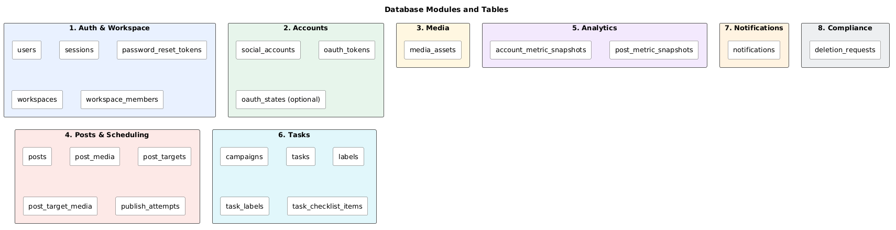

# Database Design

## 1. Overview
- **DBMS:** PostgreSQL, one database, one schema (`public`).
- **Source of truth:** the DB, not the queue. The Scheduler polls it for due `post_targets`.
- **Tenancy:** every top-level table has `workspace_id`, so access checks are one rule (NFR-2.4).
- **Ownership rule:** each module reads and writes only its own tables. Other modules use its service or reference its IDs.

## 2. Modules and tables

| # | Module | Responsibility | Tables | Requirements |
|---|--------|----------------|--------|--------------|
| 1 | Auth & Workspace | Users, sessions, time zone, membership | users, sessions, password_reset_tokens, workspaces, workspace_members | FR-1.x |
| 2 | Accounts | OAuth connections and token storage | social_accounts, oauth_tokens, oauth_states (optional) | FR-2.x, NFR-2.x |
| 3 | Media | Uploads and media library | media_assets | FR-3.8, NFR-4.3 |
| 4 | Posts & Scheduling | Drafts, overrides, schedule, publish state and attempts | posts, post_media, post_targets, post_target_media, publish_attempts | FR-3.x, FR-4.x, NFR-1.x |
| 5 | Analytics | Synced metric snapshots | account_metric_snapshots, post_metric_snapshots | FR-5.x, NFR-4.2 |
| 6 | Tasks | Board, campaigns, checklists | campaigns, tasks, labels, task_labels, task_checklist_items | FR-6.x |
| 7 | Notifications | In-app notifications | notifications | FR-7.x |
| 8 | Compliance | Data deletion and Meta callback | deletion_requests | FR-9.x, NFR-3.1 |

## 3. Conventions
- Primary keys: UUID.
- Timestamps: stored in UTC, shown in the user's time zone (NFR-6.5).
- Every table has `created_at`. Add `updated_at` where rows change.
- Statuses are enums or constrained strings.
- JSONB only for platform-specific data (`platform_options`, `extra`). Filter and sort fields are real columns.
- Text columns must store Arabic and emoji correctly (UTF-8, NFR-6.4).

## 4. Key design decisions
1. **`post_targets` is the core table.** One row per post per account. It holds the state machine (`scheduled → publishing → published/failed`), so each platform succeeds or fails independently.
2. **`scheduled_at` is per target**, since FR-4.1 allows a different time per platform.
3. **Tokens are in their own table** (`oauth_tokens`), encrypted, so a normal query on `social_accounts` can never expose them.
4. **`publish_attempts` is separate** to keep the retry history without bloating the table the poller scans.
5. **Metrics are append-only snapshots.** The dashboard reads stored data and never calls platforms live.
6. **Workspace as tenant.** One workspace per user in the MVP, with room for teams later.

## 5. Deferred
- AI insights tables (FR-8.x), added in the late MVP.

## 6. Diagrams
- Modules overview: `modules-overview.puml` (done).
- Full ERD: `erd-full.puml` (todo).
- Posts & Scheduling ERD: `erd-posts-scheduling.puml` (todo).